## 前言

后续开发可能都是把[团队仓库](https://github.com/da3monu/teamwork.git)fork到自己的仓库，最后再合并
这里就展示git命令行的方法，现在选题还未确定，也不好介绍其他集成开发环境的的git使用，大差不差

## fork项目

`daem0nu`账户作为队员角度,`da3monu`账户作为团队仓库拥有者角度

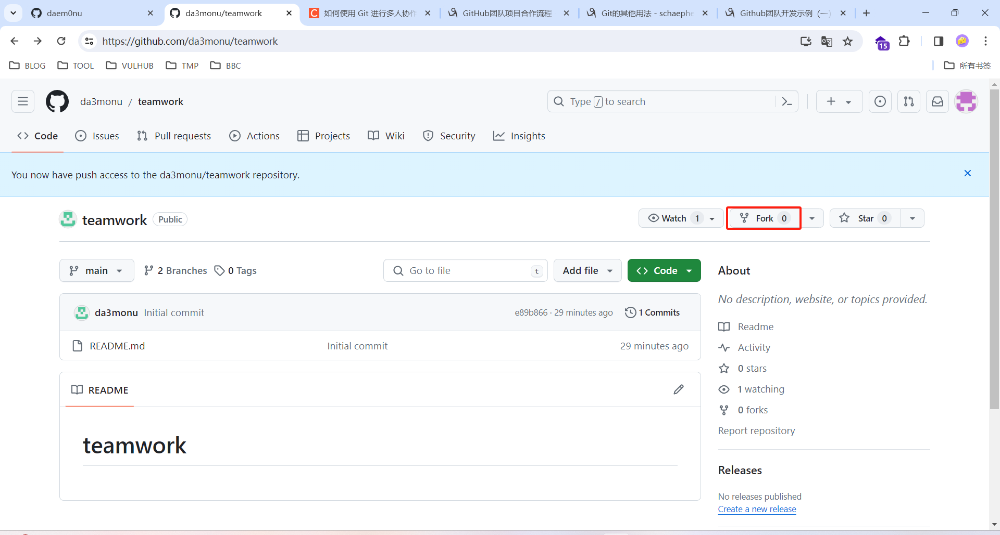

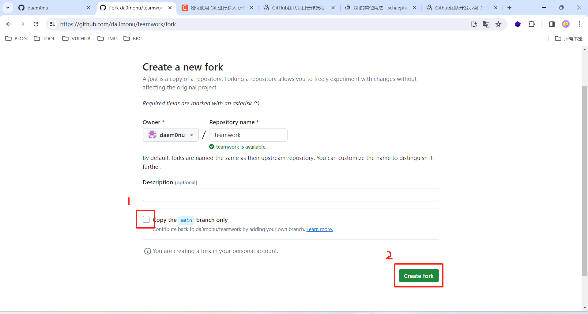

clone到本地

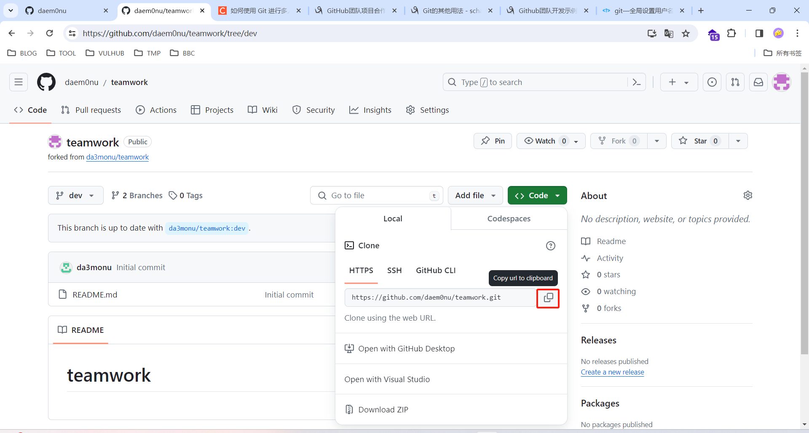

执行`git branch`看到现在本地只有`main`分支，dev分支算是开发分支，main分支作为发行分支

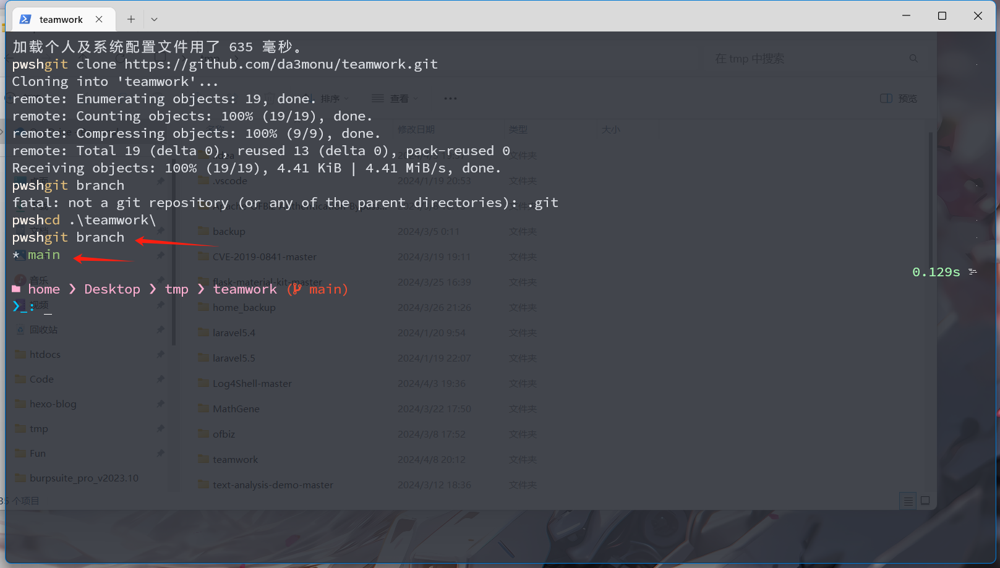

执行`git branch -a`看到远端仓库现有两条分支

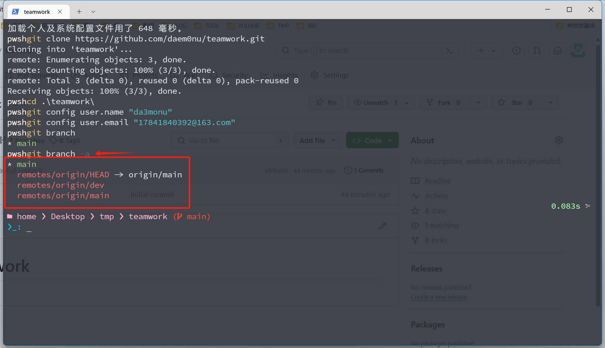

这里要切换到dev分支，执行`git checkout -b dev origin/dev`
解释一下参数
 - -b dev 本地创建dev分支
 - origin/dev 把远端仓库的内容clone到本地dev分支
 - checkout 本地切换到dev分支

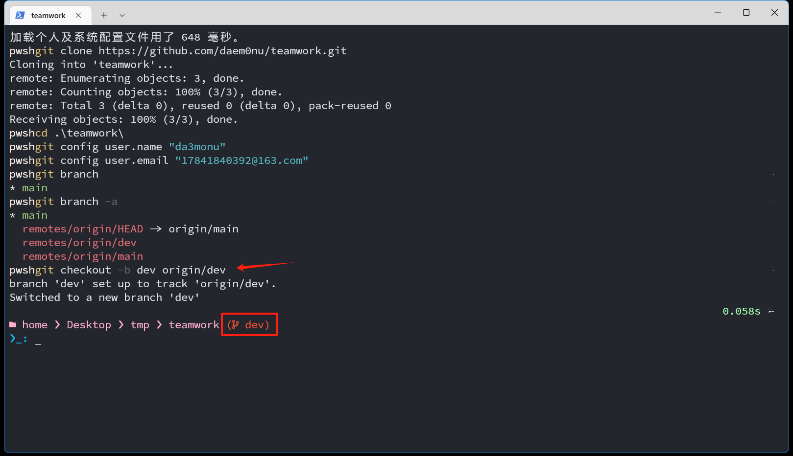

现在就可以在dev分支开发了，想切换回master分支的时候，再用`git checkout main`即可

## 和团队同步

防止你开发完成前已经有人比你先更新仓库

配置源分支`git remote add upstream https://github.com/da3monu/teamwork.git`

查看源分支`git remote -v`

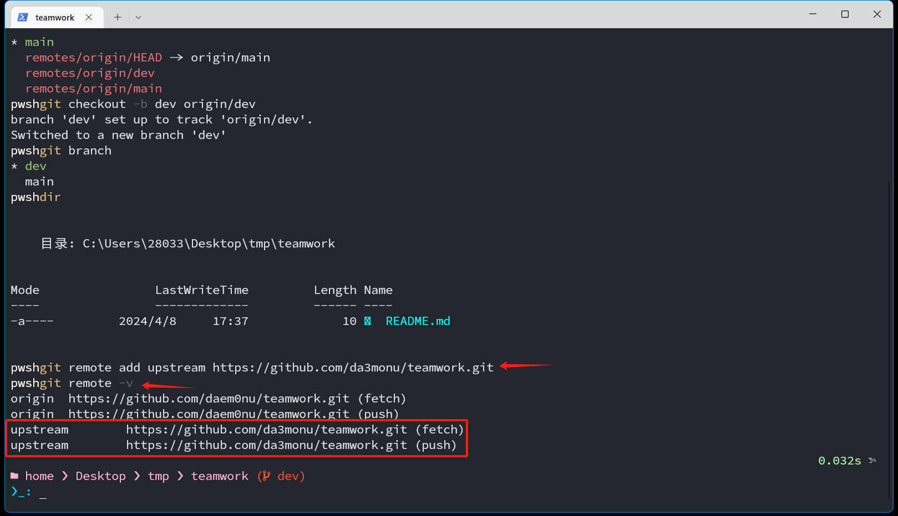

获取仓库最新版本`git fetch upstream`

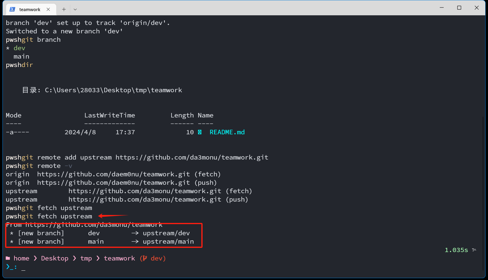

合并到本地分支`git merge upstream/dev`

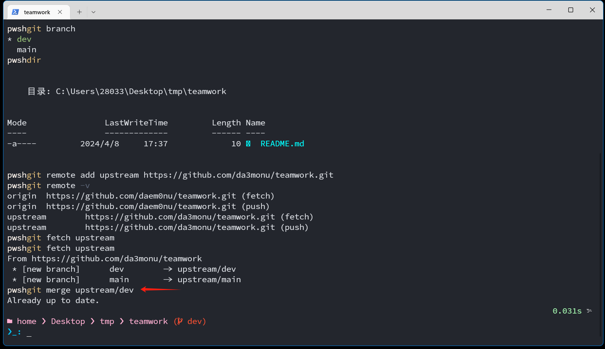

这个我暂时没遇到过，具体问题具体分析吧。合并冲突解决<https://www.cnblogs.com/schaepher/p/4970291.html#conflict>

## push到自己的仓库

`git push`

## 请求合并到团队项目上 

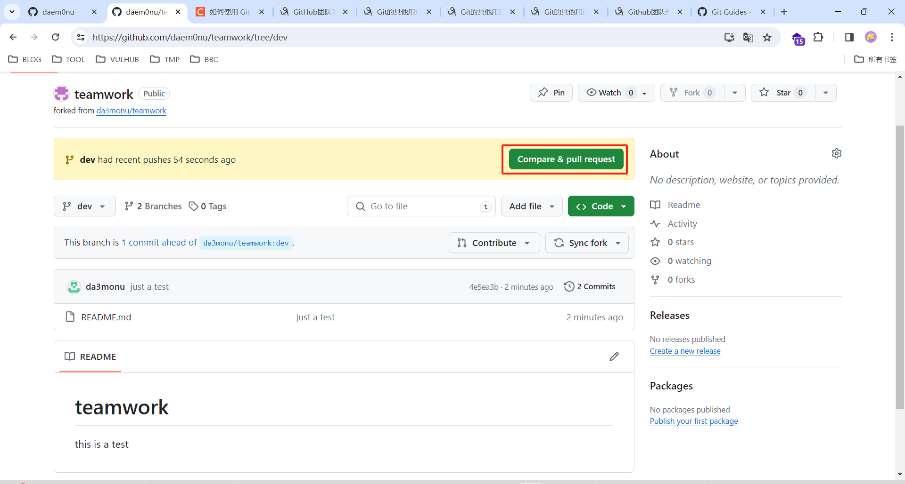

后面可能会变成这样

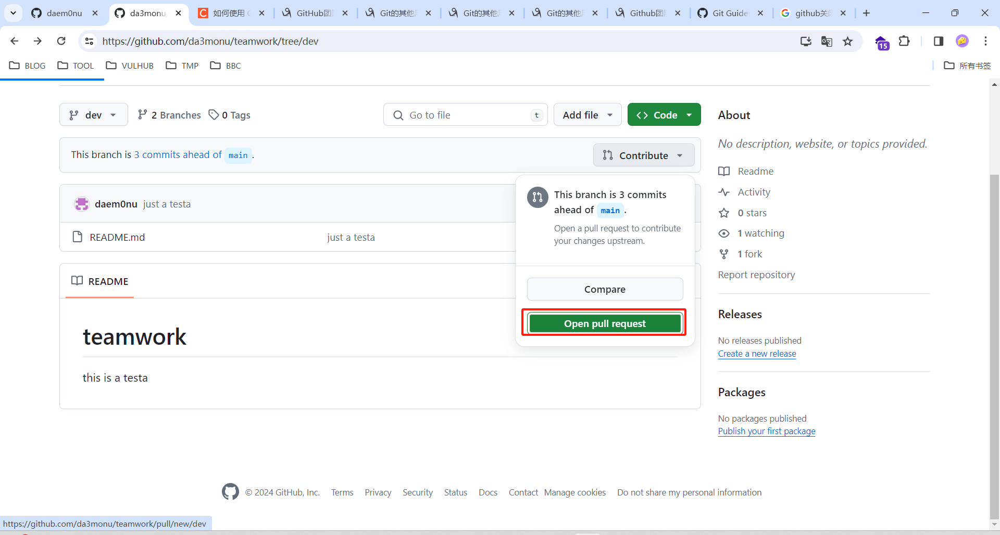

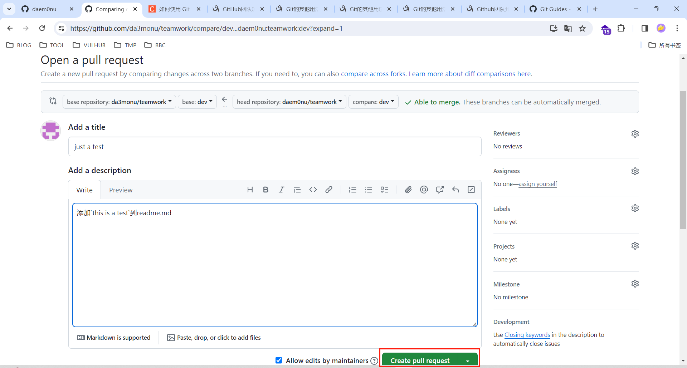

最后如果没有冲突的话，点击提交即可，会同步到团队仓库的`main`和`dev`分支。tips:全员都有权限直接提交到团队仓库，这里开发的时候要仔细校对，可以的话，尽量让负责人来判断是否提交，防止误操作，到时候再看看要不要限权吧

**参考**: <https://www.cnblogs.com/schaepher/p/4933873.html>